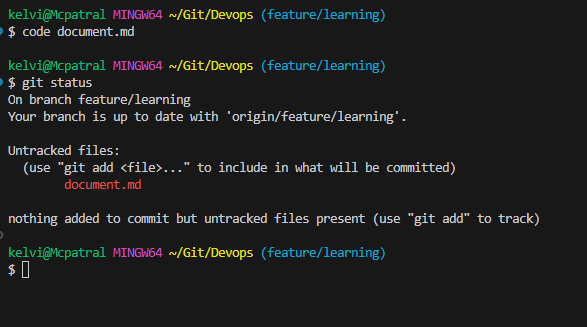
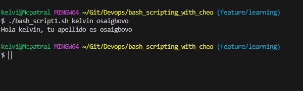

# Introducción
**Intente aprender a utilizar lo siguiente**:
1. git clone
2. git status
3. git add
4. git commit
5. git push

```
Por favor asegúrese de ver el video de la clase y si no entiende nada por favor contácteme
```

```
git status
```


```
salida del script
```
